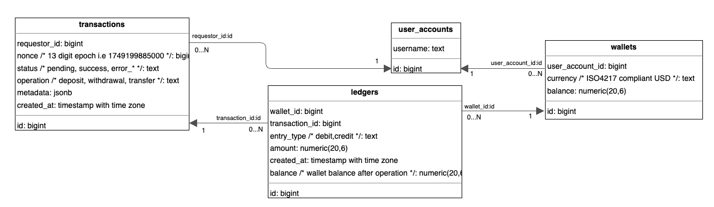

# Wallet API

Table of Contents
=================
* [Setup (Local Environment)](#setup-local-environment)
    * [Requirements](#requirements)
        * [Fetch Repository](#fetch-repository)
        * [PostgreSQL Instance](#postgresql-instance)
        * [Start HTTP Server](#start-http-server)
        * [Run e2e Tests](#run-e2e-tests)
* [Design](#designdevelopment-approach)
    * [Glossary](#glossary)
    * [Functional Requirements](#functional-requirements)
        * [Wallet Transaction Security](#wallet-transaction-security)
    * [Non\-functional Requirements](#non-functional-requirements)
        * [Wallet Idempotency](#wallet-idempotency)
        * [Atomicity](#atomicity)
    * [API Endpoints](#api-endpoints)
        * [API Docs Generation](#api-docs-generation)
        * [Endpoints](#endpoints)
    * [Database Design](#database-design)
        * [Relationships](#relationships)
* [Areas to Improve On and Features to Add](#areas-to-improve-on-and-features-to-add)


## Setup (Local Environment)

### Requirements

- Service: `go 1.23.0`, `psql (PostgreSQL) 17.5`
- Development: [swag](https://github.com/swaggo/swag)

#### Fetch Repository

``` /bin/sh
git clone https://github.com/cryptonlx/crypto.git
cd crypto
# set hook
cp ./pre-commit.sample .git/hooks/pre-commit
# copy env
cp .env .env.sample
```

#### PostgreSQL Instance

Execute DDL on a new database `cryptocom`:

```
# Tear down
psql -d cryptocom < ./schemas/schema_001_down_init.sql
# Set up
psql -d cryptocom < ./schemas/schema_001_up_init.sql
```

1. #### Start HTTP Server


```
go run ./cmd/server
```

See [API Endpoints](#api-endpoints) for API reference.

2. #### Run e2e Tests

Execute [test_plan](./test_plan.md):

```
SERVER_URL=<server_url> N=<parallel_runs> go test -count=1 -v ./...

# Example: SERVER_URL=http://localhost:8080 N=120 go test -count=1 -v ./...
```

## Design/Development Approach

The HTTP [API Endpoints](#api-endpoints) are drafted and tests will be written accordingly to verify the behavior via
the API contract.
The tests are end-to-end and will require external connections (db etc.).

- Understand requirements.
- Create [Test Plan](./test_plan.md).
- Write failing test cases iteratively @ [e2etests](./cmd/e2e_tests)
    - Implement
        - http handlers (pkg: [controllers/mux](./src/controllers/mux))
        - application domain logic (pkg: [services](./src/services))
        - database layer (pkg: [repositories](./src/repositories), schema: [DDL](./schemas))
    - Verify, refine and update API contract.

### Glossary

| **Term**        | Description                                                                                       |
  |-----------------|---------------------------------------------------------------------------------------------------|
| **User**        | An account that can own one or more wallets.                                                      |
| **Wallet**      | A value store for a specific currency, owned by a User.                                           |
| **Transaction** | A wallet operation (deposit, withdrawal, or transfer) requested by a User.                        |
| **Ledger**      | An authoritative record of change in wallet value. A transaction can consist of multiple ledgers. |

### Functional Requirements

- Create new user.
- Each user can have multiple wallets.
- Supports deposit and withdrawal.
- Supports transfer from/to wallets.
- Viewing of wallet balance.
- Viewing of transaction history.

#### Wallet Transaction Security

- Deposit/Withdraw/Transfer requests require a Basic Auth header:

```
    Authorization: Basic <Base64(username:)>
```

The username must match:

- Deposit: user of wallet to deposit amount (credited wallet).
- Withdraw: user of wallet to withdraw amount (debited wallet).
- Transfer: user of wallet to debit amount from.

### Non-functional Requirements

#### Wallet Idempotency

- Idempotency for deposit/withdraw/transfer requests:
    - Include a 13-digit unix timestamp as nonce field for request identification.
    - Subsequent requests from same user with same `nonce` will be treated as duplicitous.
    - Each request can succeed at most once. Retries are not allowed.

#### Atomicity

- Each request should be processed atomically across affected database tables to ensure data integrity.

### API Endpoints

#### API Docs Generation

Install [swag](https://github.com/swaggo/swag) and generate docs:

`swag init --parseDependency --dir ./src/controller/mux/user`

#### API Reference
Go to http://localhost:8080/swagger/index.html after running local server.

#### Endpoints

1. **[API-WALL-DEP]** Deposit to user's wallet.\
   `/POST /wallet/deposit`
    - See [Wallet Idempotency](#wallet-idempotency), [Wallet Security](#wallet-transaction-security)


2. **[API-WALL-WDR]** Withdraw from user's wallet.\
   `/POST /wallet/withdrawal`
    - See [Wallet Idempotency](#wallet-idempotency), [Wallet Security](#wallet-transaction-security)


3. **[API-WALL-TRF]** Transfer from one user's wallet to another user's wallet.\
   `/POST /wallet/transfer`
    - See [Wallet Idempotency](#wallet-idempotency), [Wallet Security](#wallet-transaction-security)
    - currency type of wallets must match.

4. **[API-USER-BAL]** Get balances of user's wallets.\
   `/GET /user/{username}/wallets`


5. **[API-USER-TXH]** Get user's transaction history sorted by newest.\
   `/GET /user/{username}/transactions`
    - Get transactions requested by user. Ledgers of other user's wallet will be omitted.
    - Includes ledgers of user's wallet not recorded from a transaction requested by the user.

6. **[API-USER-NEW]** Create new user.\
   `/POST /user`
    - Fails on conflict with existing user. User identification by `username`.


7. **[API-WALL-NEW]** Create new wallet for user.

   `/POST /wallet`

### Database Design

Folder: [./schemas](./schemas)

##### Relationships



## Areas to Improve On and Features to Add

- Testing
    - Add table-driven unit tests to test in packages to test in isolation for more confidence.
    - Improve test coverage and quality by testing edge cases.
    - Benchmark for response time. Some indexes are added based on current use cases, but yet to verify if performant under load.
- Delivery
    - Containerize application for portability.
- Scalability
    - Consider service availability/maintainability for massive operations.
        - Set rate limiting per endpoint basis to stabilise server. Use Redis to store rate limiter's state a server
          cluster (upgrade server to stateless).
    - Support for asynchronous services.
        - For example, notify on operation fail/success, balance change etc.
- List Payload Selection
    - List responses should have pagination, sorting and filter parameters to return subset as result.
    - Limit response payload size.
- Greater API Flexibility
    - Currency Value and Unit Type
        - Support for currency validation.
        - Support for cross-currency transfer.
        - Decide if value type assignment in PostgreSQL is fit for purpose. There are a few options to choose from:
            - Currently stored as `numeric(20,6)`.
            - Multiply value by 1000x and store as `bigint`.
            - Store as floating point.
            - Store as `money`.
    - Real time currency conversion and broker fees calculation for effective transaction value
- Security
    - Principal authorization for wallet transactions via token issuance or session.
    - Ensure request integrity via payload signing.
- Observability
    - Record failed transactions for auditing.
    - Request tracing and structured logging for easy debugging.
